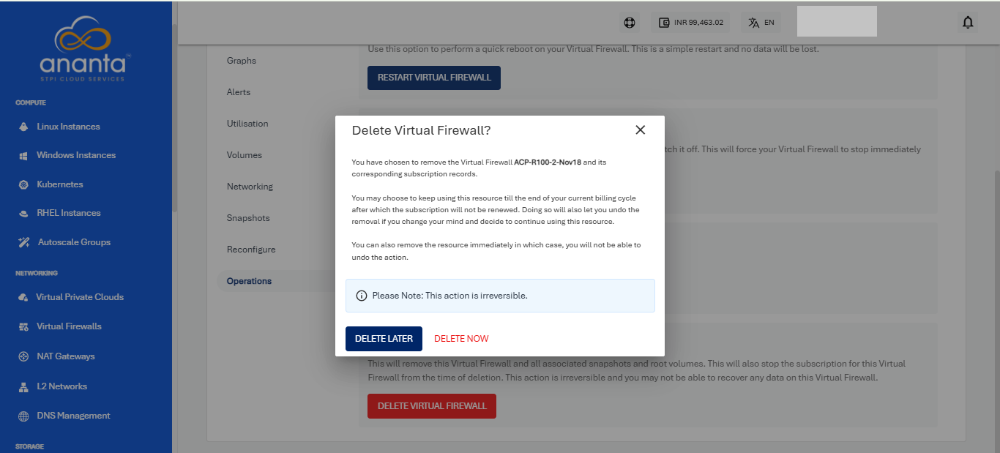

# Deleting a VFI Network

Subscribers can unsubscribe from the Virtual Firewall service by deleting the VFI. Before deleting a VFI, any Instance(s) added to the network need to be deleted.

Once you click on the delete Virtual Firewall, a request will be raised to the admin (if approval-based provisioning is enabled for the VFI Service). 

As soon as the admin approves the request, your virtual firewall service for that particular availability zone will be unsubscribed.

Admin needs to click on approve, and then a confirmation popover will open for the admins to click on **OK**, and the service will be deactivated, and the end user will be intimated of the same through an email.

