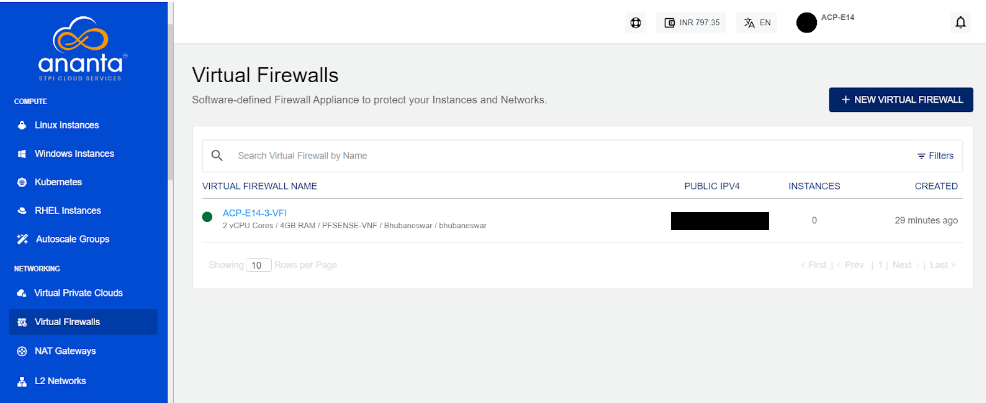

# About Firewall Instances

Virtual Firewalls enables you to use Virtual Firewalls in a Virtualized Network Function (VNF) style, which include support for multiple VLANs and Public IPv4 addresses and automated service activation. This allows for more robust firewall management capabilities.

The Service falls under the **Virtual Firewall** and is built using our integration framework using [pfSense](https://pfsense.org/) or [FortiGate VM](https://www.fortinet.com/products/private-cloud-security/fortigate-virtual-appliances) for powering the appliance.

The following are the important features:
- Multi-VLAN support and multiple Public IPv4 addresses for Virtual Firewalls.
- Automated service activation, reducing the need for manual intervention.
- Subscribers can create, configure, and manage Virtual Firewalls with enhanced network interface controls, snapshots, etc.
- Limitations include predefined WAN-LAN configurations and one firewall per gateway.

All virtual firewalls created in an account can be accessed from navigating to the **Networking > Virtual Firewalls** tab.

