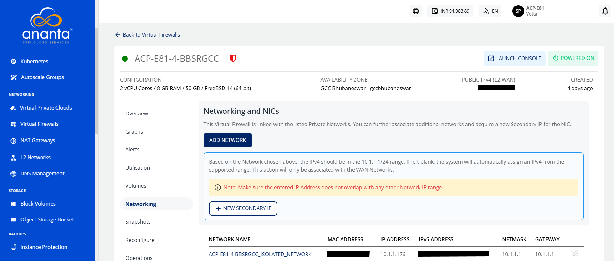

# Networking Management

To view the networks that of particular Instance, navigate to the Virtual Firewall and access the **Networking** tab.

The Networking and NICs section list all the networks that a Linux Instance is attached to.

The following actions are available:

- If the Instance is inside a VPC, you can associate the Instance to multiple tiers within the VPC or share the Instance with other VPC networks in the same Availability Zone by using the **ADD NETWORK** option.
- Network/tier associations can be removed from this section by using the **unlink** action.

:::note
Advanced networking configurations can be done using the Virtual Cloud service.
:::