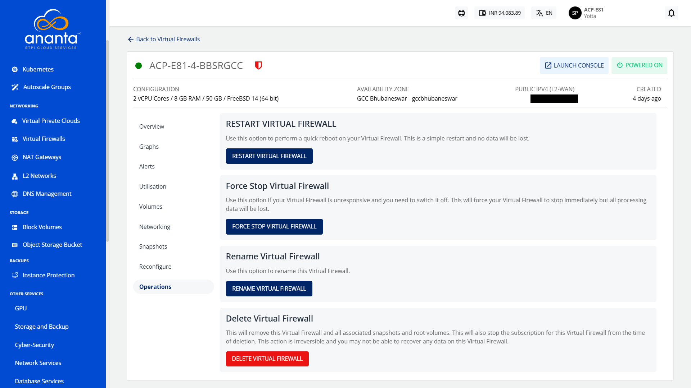

# Operations

To view all available Instance operations, navigate to the Virtual Firewall and access the **Operations** tab.

Ananta Cloud Console provides the options to perform the following operations on Virtual Firewall:
- **Restart Instance** - Perform a quick reboot on your Instance. This is a simple restart, and no data will be lost.
- **Force Stop Instance** - Force stop a running or a hung Virtual Firewall.
- **Rename Instance** - Rename the Virtual Firewall.
- **Delete Instance** - Delete the Virtual Firewall.
  :::warning
	Deleting a Virtual Firewall will remove it entirely along with its subscription and is a non-reversible action.
    :::