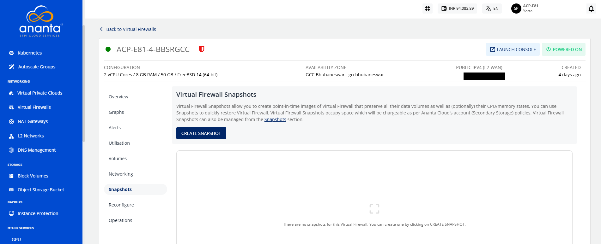

# Snapshots

To view all the Snapshots taken for Instance, navigate to the Virtual Firewall and access the **Snapshots** tab.

Instance Snapshots allow you to create point-in-time images of instances that preserve all their data volume as well as (optionally) their CPU/memory states. You can use Snapshots to quickly restore Instances.

The Snapshots section shows all the Virtual Firewall Snapshots, which can be used to revert the Virtual Firewall to an earlier state. 

A Snapshot lists the following details:

- Snapshot Name
- Description
- Internal Name
- Type
- Created On 

The following quick options are available:

- Revert the Instance from the Snapshot
- Delete the Snapshot

## Creating a Snapshot

To create a Snapshot, follow these steps:

1. Click on the **CREATE SNAPSHOT** button. The Take Snapshot window appears.
2. Enter the **Name** of the Snapshot and the **Description** of the Snapshot.
3. Click on the **Create** button. The Snapshot will be created. 