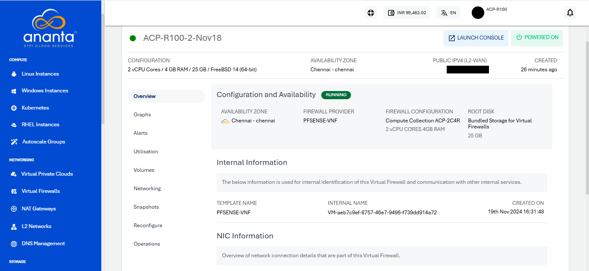

# Viewing VFI Network Details

As the VFI and the VFI-based network are created, Cloud Console users can view the enabled Virtual Firewall in the **Networking > Virtual Firewalls** section. Clicking on this section, the following details will be shown:

1. List of all the Virtual Firewall domains as per the Availability Zone
2. Name of the Virtual Firewall
3. Availability Zone
4. L2-WAN IPV4
5. No. of Instances associated with the particular Virtual Firewall

To view the details of Virtual Firewall, Click the Virtual Firewall name. Additionally, users will also be able to log in to the Virtual Firewall’s self-service UI.

