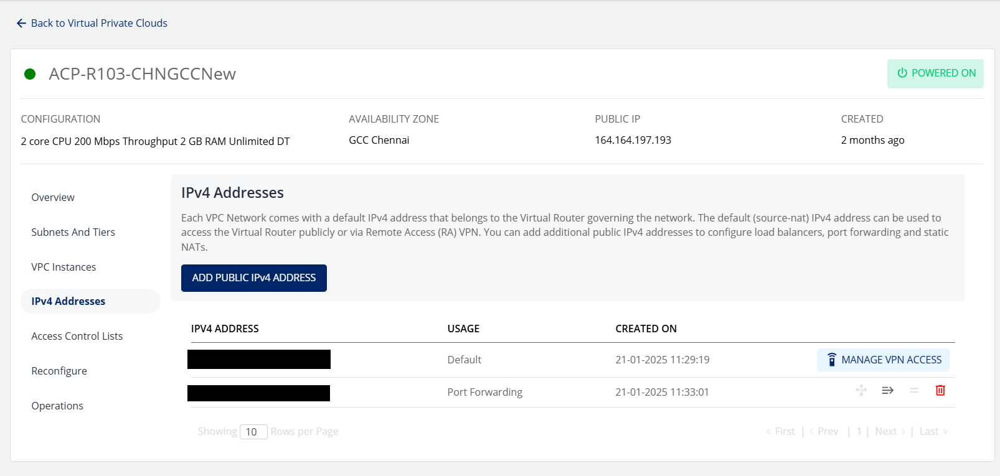
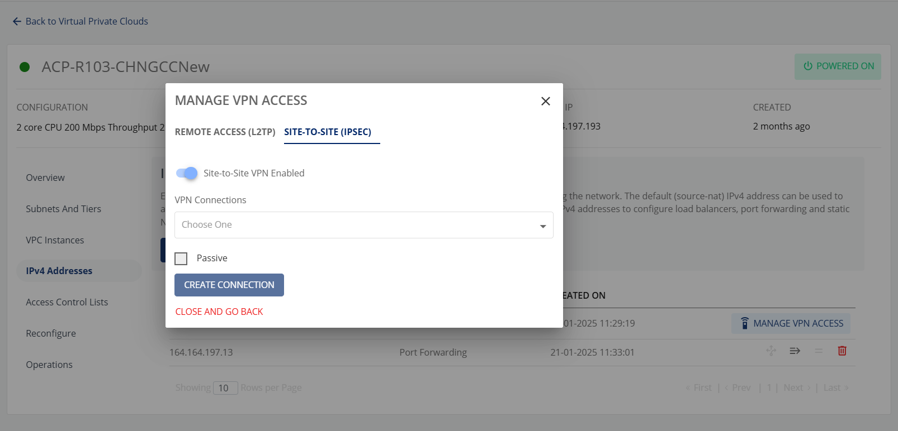

# Managing VPN Gateways and Site-to-Site VPN

Site-to-site **VPN**It securely connects users to a private network over the internet by encrypting their data and masking their IP address.gateways can be configured from the **Networking > VPN Gateways** section on the main navigation panel. To create a VPN gateway, navigate to the VPN Gateways section and click the **Add Gateway** button. This will open up a dialog box with IPSec tunnel detail requirements.

:::note
 You’ll need to obtain the gateway details from your ISP’s control panel or the primary firewall console.
 :::
## Using Site-to-Site VPN Connections with a VPC

To use a site-to-site VPN connection into your VPC, you’ll need to first define a VPN gateway by following the steps in the above section. Once the gateway has been configured, follow these steps:

1. Navigate to **Networking  > Virtual Private Clouds** from the main navigation panel and enter the VPC that you wish to connect to use the VPN.
   
2. Navigate to VPC, select the **IPv4 ADDRESSES** section, and click the Manage VPN access. After this click the Enable **Site-to-Site(IPSEC) VPN** option.
   
3. Then select **VPN Connection** from the list of all the VPN connections i.e. the VPN gateway you want to connect to this VPC. Click the C**REATE CONNECTION** button.

To test this configuration, you can ping any of the subnet IPs or the VR’s default IP from within your external private network.

