# Using Remote Access VPN with VPC

To use a VPN client to connect to your VPC, follow these steps:

1. Navigate to  **Networking > Virtual Private Clouds** from the main navigation panel and enter the VPC that you wish to connect using your VPN client.
   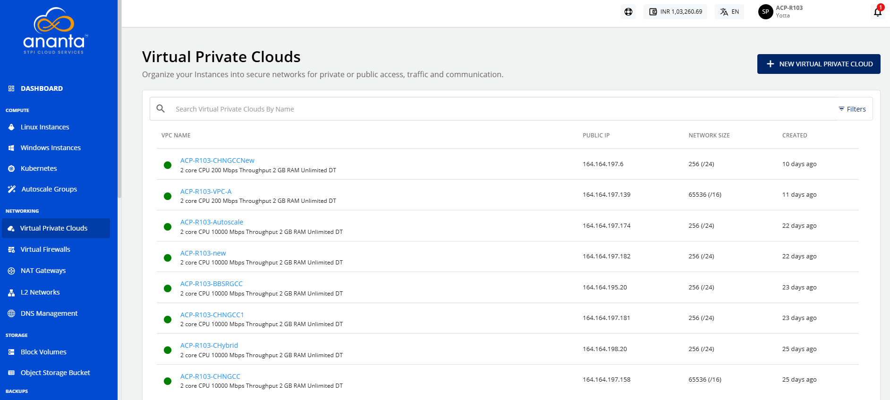
2. To enable the switch for the Remote Access VPN, navigate to VPC, Click the **Manage VPN access** available under the **IPv4 ADDRESSES** section, then click on the **Remote Access (L2TP)** option.
   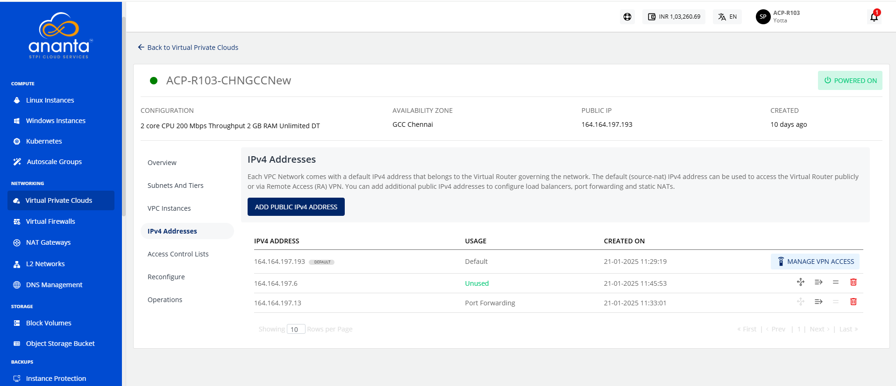
   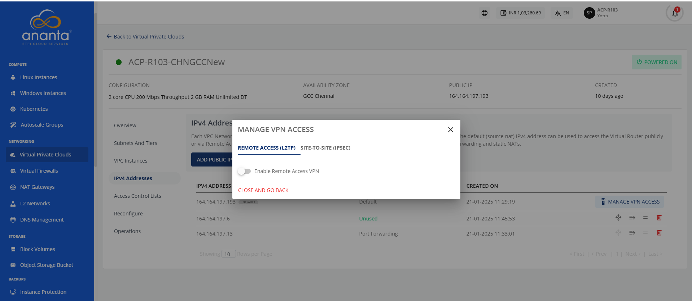
3. This will also enable the **Remote Access VPN** button for the VPC’s default IP. Click on the button to copy the pre-shared key (PSK) and the IP range from the dialog box to use in your VPN client.
   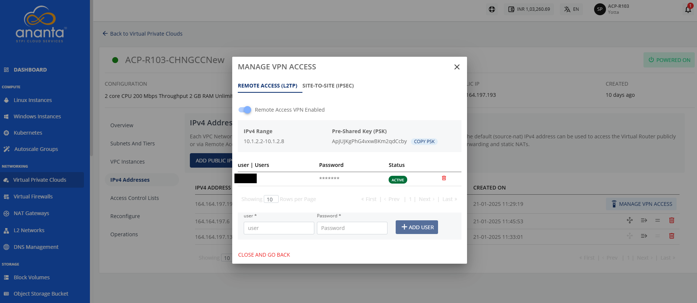
4. Additionally, you’ll need to add VPN user credentials here.

To test this configuration, you can open the VPN client on your local system and try connecting to the VPC.

## Configuring VPN on Windows

To  configure a VPN Connection on Windows using Native VPN client, follow these steps:

1. Open the **Control Panel**, navigate to **Network and Internet**.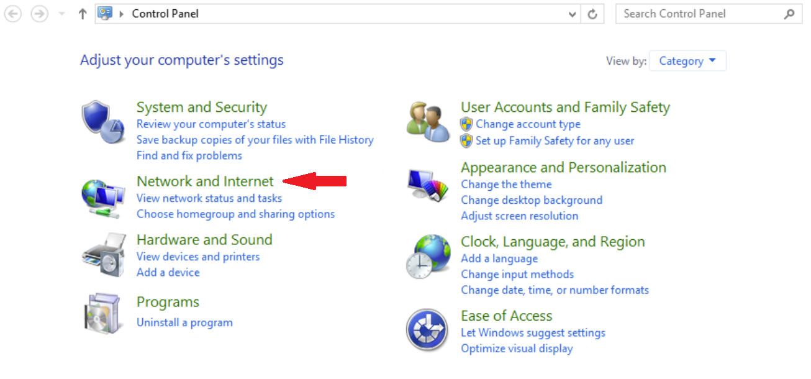
2. Select **Network and Sharing Center**.
    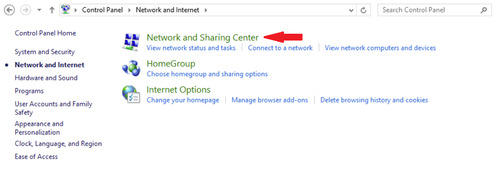
2. Under **Change your networking settings**, click **Set up a new network connection or network**.
   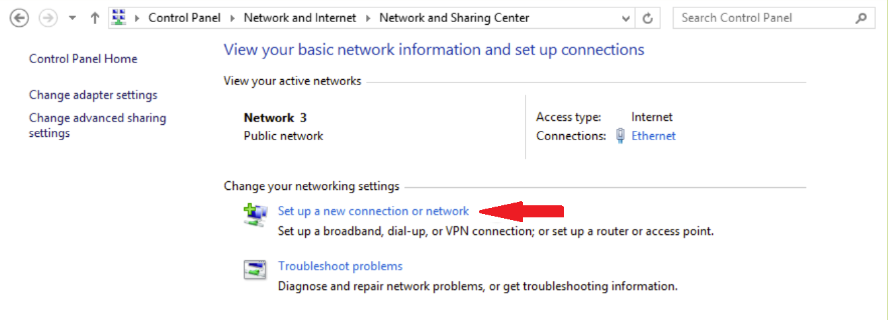
3. The following window appears. Select **Connect to a workplace**, and click **Next**.
   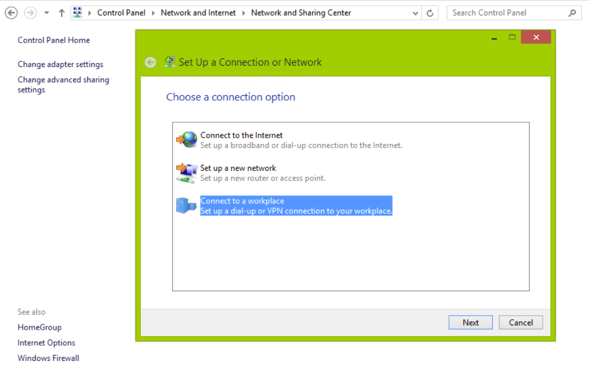
4. Select the **Use my Internet connection(VPN)** option.
   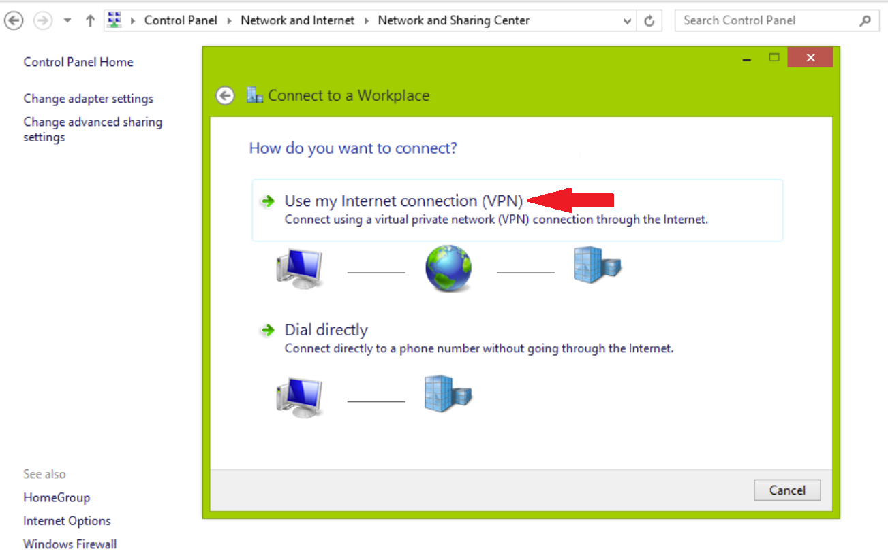
5. The following window appears. Enter the **Internet address** (refer **IPv4 Address** from **point 2** under **Using Remote Access VPN with VPC** ).	   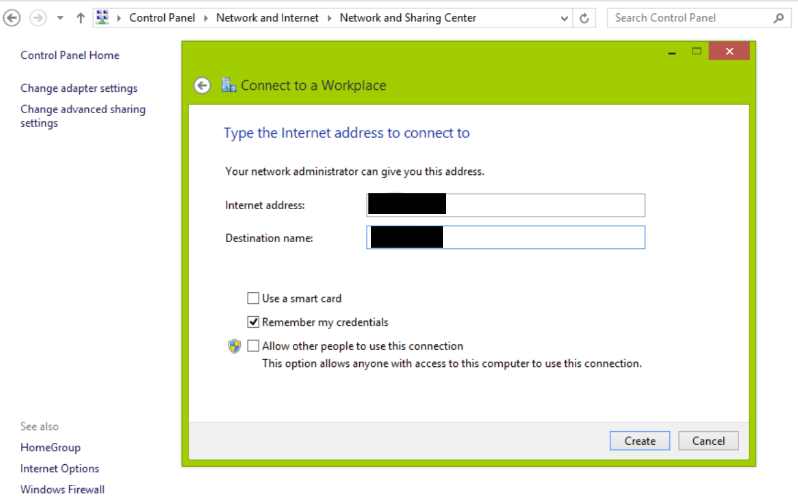
6. Select the **Remember my credentials** option, and click **Create**.
7. To configure VPN settings, open **Network and Sharing Center**, and click **Change adapter settings**.
   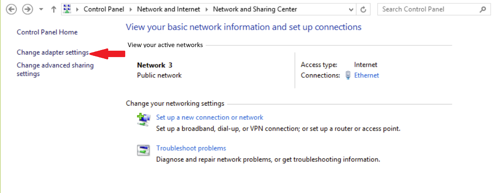
8. Navigate back to **Network and Internet**, then select **Network Connections**.
   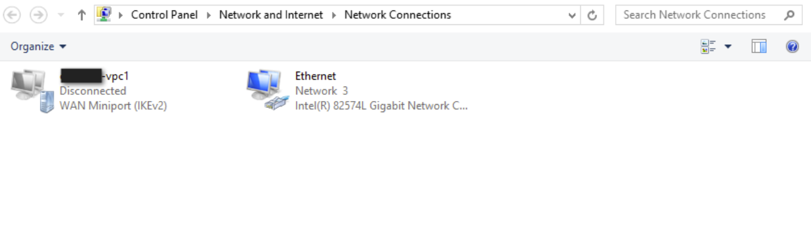
9. Locate your **VPC network**, right-click on it, and select **Properties**.
   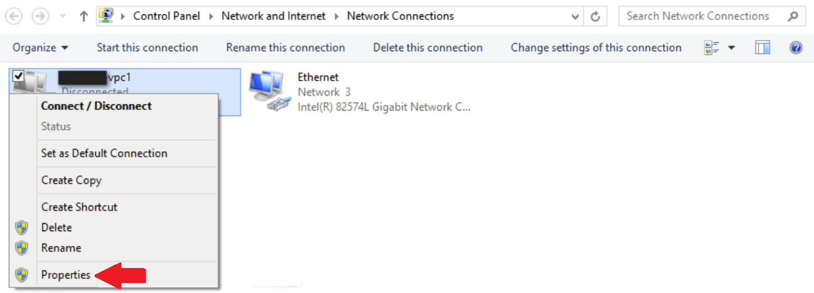
10. The Properties window appears: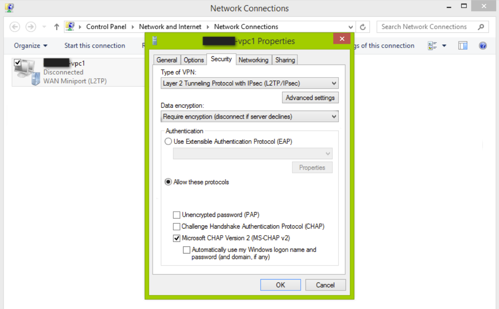
11. In the **Properties** window, navigate to the **Security** tab.
	- Under **Type of VPN**, select **L2TP/IPsec**.
	- In the **Data Encryption** field, choose **Require encryption**.
	- Select the **Allow these protocols** option.
	- Select **Microsoft CHAP Version 2(MS-CHAP v2)**.
12. Click the **Advanced settings** button. The following window appears: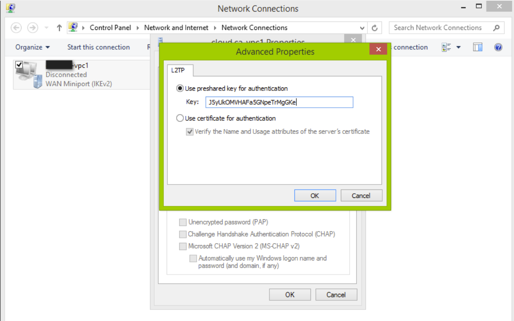
13. Select the **Use pre-shared key for authentication** option (for pre-shared key refer to **point 3** under **Using Remote Access VPN with VPC** ).
14. Click **OK** to save your settings.    
15. To initiate the VPN connection, navigate to **Network > Connection Settings**, then click **Connect**.
    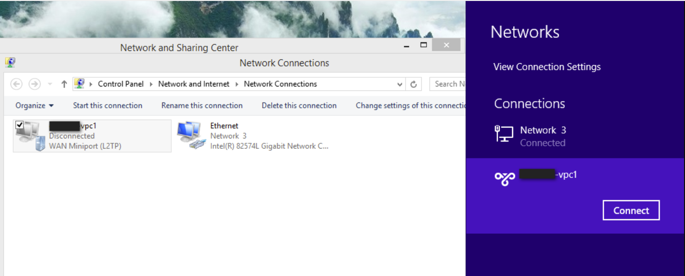
16. Enter your **Username** and **Password**, click **OK**.
    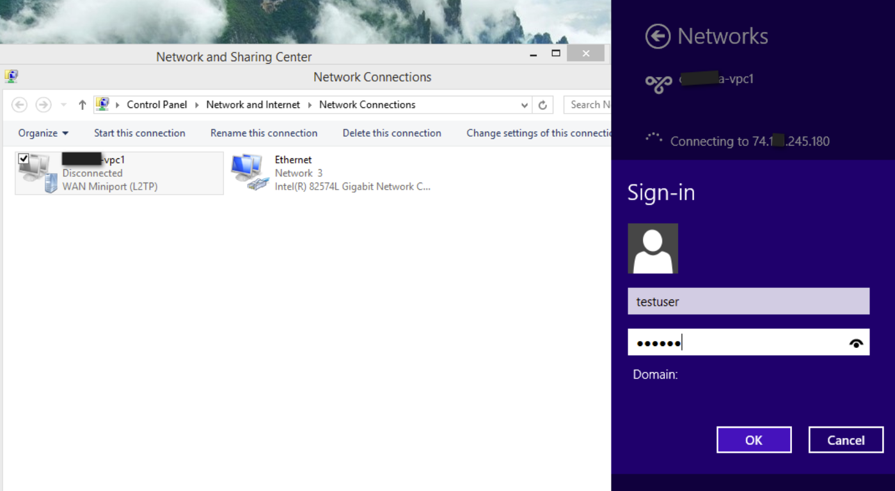

 The configuration is successful.
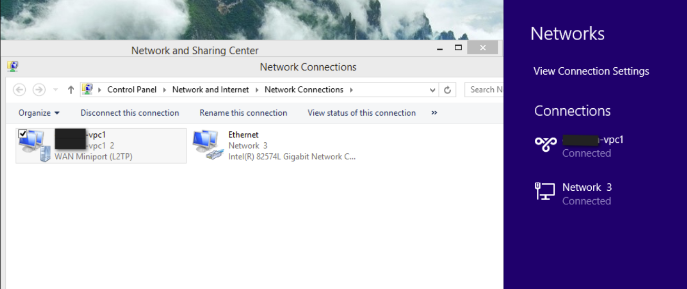

