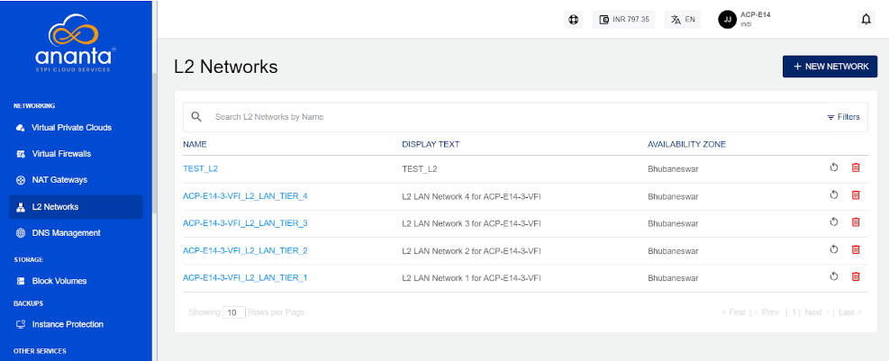

# About L2 Networks

L2 networks, often called data link layer networks, play a crucial role in computer networking by establishing direct connections between devices in a local network and ensuring data packets are delivered accurately to their intended destination.

To manage L2 networks, navigate to **Networking > L2 Networks**. 

The following screen appears where all the L2 networks are listed. 

Click the icons at the end of each network for the following operations:
- **Restart** the L2 network.
- **Delete** the L2 Network.
   

