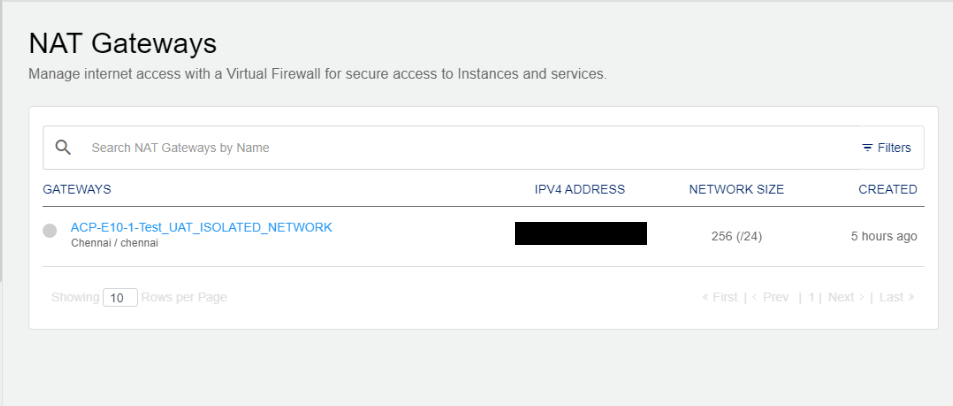
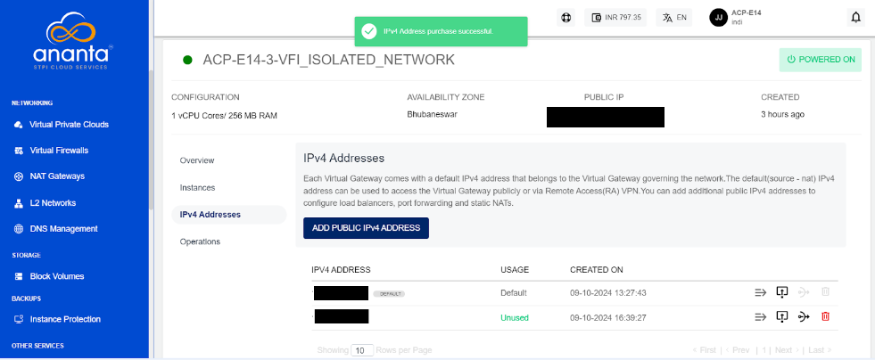
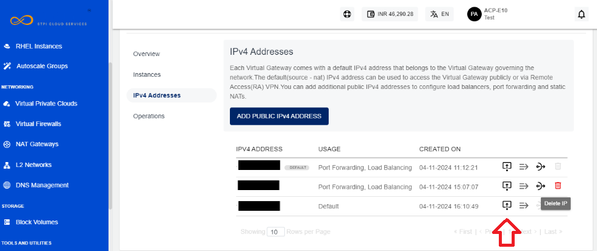
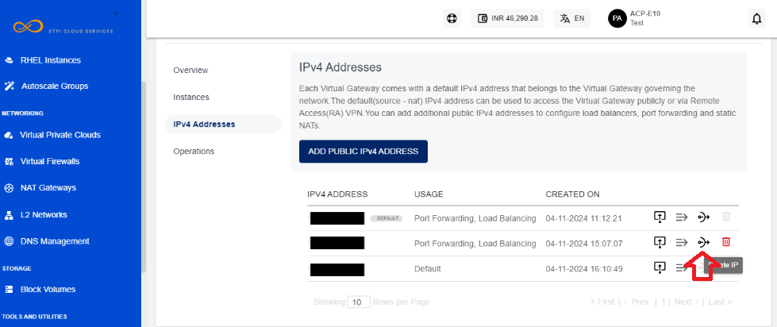
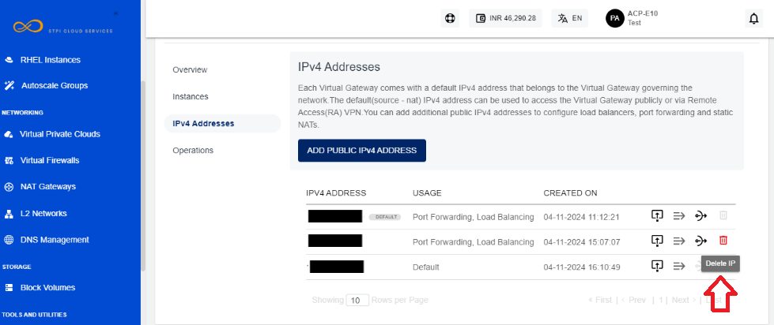
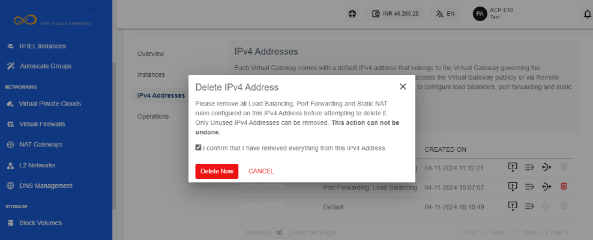
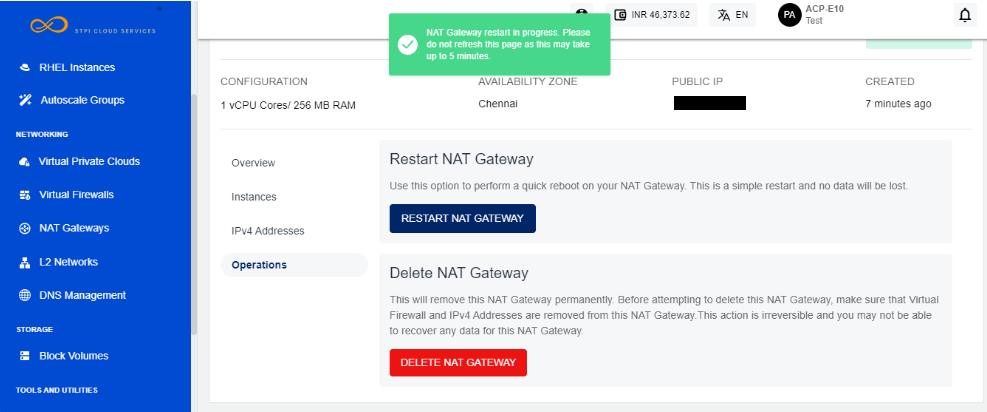

# Managing NAT Gateways

To manage a NAT gateway, follow these steps:

1. Navigate to **Networking > NAT Gateways**.
   
2. Click on a **gateway** from the list. 

The gateways show the details under the following categories:

- [Overview](#overview)
- [Instances](#instances)
- [IPv4 Addresses](#ipv4-addresses)
- [Operations](#operations)
## Overview
Navigate to the **Overview** tab to view the following details:
- Configuration and Availability
- Internal Information

To power off the virtual router, click the **Powered On** button. The Stop Virtual Router window appears that lets you stop the virtual router. To power on a virtual router, click the **Powered Off** button.
## Instances
This section lists all the instances that are a part of this Virtual Firewall.

## IPv4 Addresses
Each virtual gateway comes with a default IPv4 address that belongs to the Virtual Gateway governing the network. The default (source - NAT) IPv4 address can be used to access the Virtual Gateway publicly or via Remote Access (RA) VPN.

### Adding Public IPv4 Addresses
You can add additional public IPv4 addresses to configure firewall rules, port forwarding rules and source NATs.

1. Click the **Add Public IPv4 Address** button. 
2. Select **Monthly** or **Hourly** option and then click the **Confirm Purchase** button. 
3. Verify the details and click the **Confirm** button to create complete adding a public IPv4 address.
### Managing Firewall Rules
1. Click on the **Firewall Rules** icon.
   
2. Enter the details as shown to create a new firewall rule.
	1. Select Traffic Rule from the drop-down list.
	2. Enter the Source CIDR.
	3. Select the Protocol from the drop-down list.
	4. Enter the Start Port. 
	5. Enter the End Port.
	6. Click **Add Rule**.

### Managing Port Forwarding Rules
1. Click on the **Port Forwarding Rule** icon.
   
	The following screen appears where you can view the already created port forwarding rules.
	
2. To add a new rule, click on **Add Rule**.
3. Enter the required details to add a rule.
4. Click the **Add Port Forwarding Rule** button.
   
### Changing Source NAT IPv4 Address
1. Click the **Source NAT** icon.
   

2. Click the **Okay** button.  
   
### Deleting IP Address
1. Click the **Delete IP** icon.
   
2. Select the checkbox and click the **Delete Now** button.
   
	:::warning
	This is an irreversible action.
	:::

## Operations
You can perform the following operations in the Operations section:
- Restart NAT Gateway
- Delete NAT Gateway

