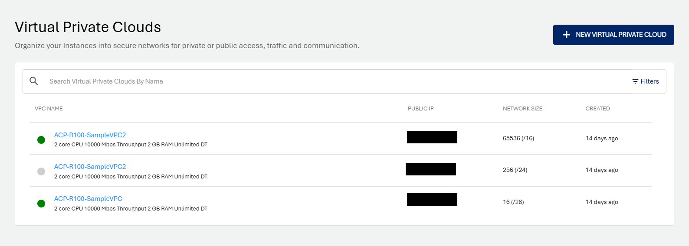
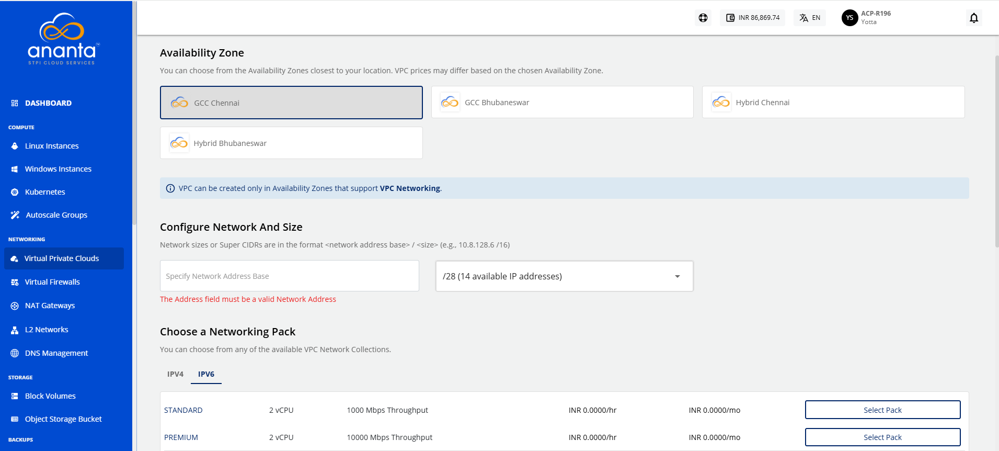
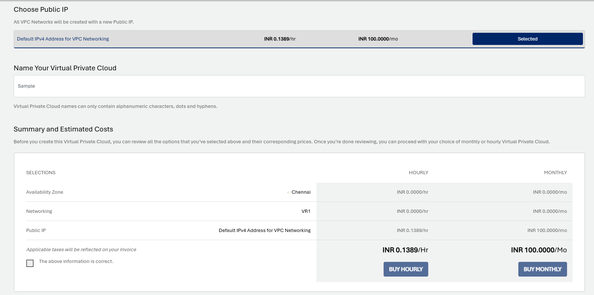
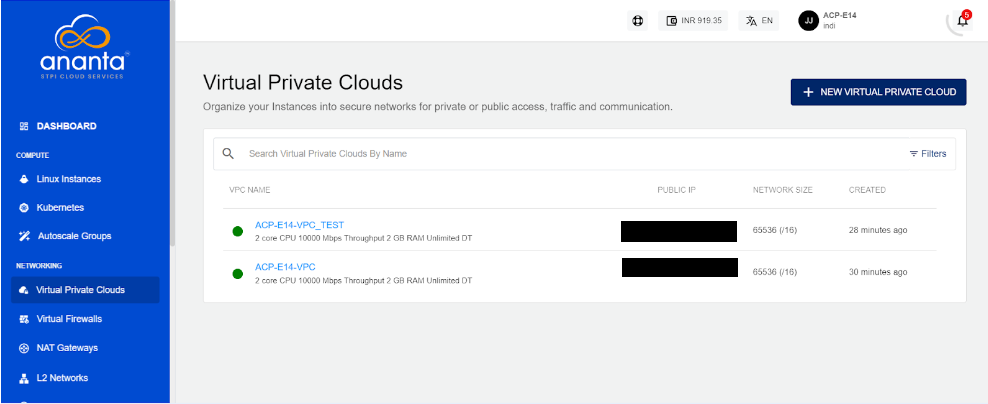
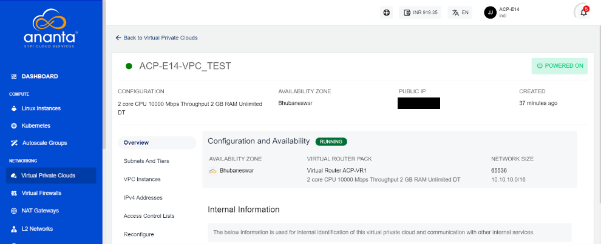

# Create, List and View VPCs

## Creating a VPC

To create a VPC, follow these steps:

1. Navigate to **Networking > Virtual Private Clouds**
2. Click on the **+ NEW VIRTUAL PRIVATE CLOUD** from the top right.
   
3. Choose an Availability Zone, which is the geographical region where your VPC will be configured.
4. Specify network address base size and select size i.e. The **super CIDR** for the internal IP allocation in an x.x.x.x/x format.
5. Choose a Networking pack from the available network collections. 
   
6. Select the default IPV4 address for VPC Networking so that the VPC network will be created with a new Public IP address.
7. Verify the Estimated Cost of your VPC, based on the options that you have chosen from the Summary and Estimated Costs Section( Here, both the Hourly and Monthly Prices summary will be displayed).
8. Click the check box after going through the policies mentioned by your cloud service provider.
   
9. To display the price summary, click the **BUY HOURLY** or **BUY MONTHLY** button, a confirmation pop-over will open up.
    1. You can apply any of the discount codes listed by clicking the **APPLY** button. 
    2. You can also remove the applied discount code by clicking the **REMOVE** button. 
    3. You can cancel your action by clicking the **CANCEL** button.
10. Click the **CONFIRM** to create the VPC.

Once ready, you’ll be notified of this purchase on your email address on record. 

:::note
This might take up to 5-8 minutes. You may use the Cloud Console during this time, but it is advised that you do not refresh the browser window.
:::
## View Available VPC

All VPC created in a user account can be accessed from **Networking >** **Virtual Private Clouds** on the main navigation panel. The following details will be displayed:

- VPC Name
- Public IP
- Network Size
- Created

## Viewing VPC Details

To view a list of sections and the various operations or actions you can perform by going inside the particular section, Click the VPC name. Below the VPC name is an informational view where you can find the details below.

- Configuration
- Availability Zone
- Public IP
- Created

Along with the summary, the following information is readily available in the **Overview** tab:

- Configuration and Availability-
    - The instance's status, **RUNNING**, is displayed in **green**, whereas **STOPPED** is displayed in greyed out.
    - Information about the Virtual Router Pack.
    - Information about the Network Size
- Internal Information- This displays the information that is used for internal identification of this VPC router and communication with other internal services.
    - Template Name
    - Virtual Router Name
    - Created On

From here on, VPC operations, configurations and other available functions can be managed by navigating to the respective tabs/sections.

