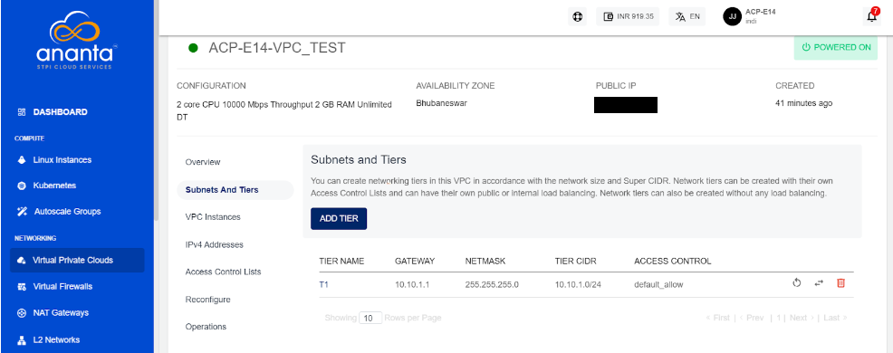

# Creating VPC Subnets/Tiers

VPCs follow the convention of 3-tiered architectures, with web, app, and DB tiers forming the norm. You can, however, configure these tiers to suit your application architecture or just follow the common convention.

To add a tier to your VPC, navigate to the VPC you wish to add the tier to,  select a **SUBNETS AND TIERS** section and click the **ADD TIER** option. A dialog box will open to ask the following information:

- **Name** of the tier.
- **Gateway** for the subnet. 
- **Subnet mask** for the tier/subnet.
- Default **access control** policy for this tier.
- **Load balancing** information for this tier.

:::note
To set up a public load balancer, you need to select **Public LB** on this dropdown. There can only be 1 tier of type Public LB in a network.
:::

Click on **ADD NETWORK TIER** to create the tier or subnet to be used as part of the VPC.

There are three icons available on the right side for quick actions like restarting the network, replacing the access control list, and deleting the tier.

:::note
Only empty tiers can be deleted, which means that in order to delete a tier, ensure that there are no Instances and no NAT rule(s) associated with it.
:::

