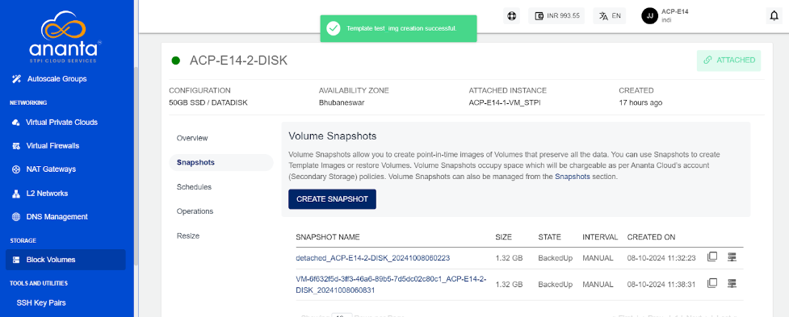

# Working with Volume Snapshots

The Ananta Block Volumes Service allows for extensively working with volume snapshots. Snapshots are point-in-time 'images' of the contents of a volume and can be used as a restoration point for the parent volume. The following sections outline all available snapshot functions and capabilities on Ananta Cloud Console.

## Creating Instant Snapshots

To create Volume Snapshot, navigate to the Snapshots tab and select CREATE SNAPSHOT. It will create a snapshot which can be used to further create an Image (template) or restore an existing volume.

## Creating Automated Snapshot Schedules

Ananta Cloud Console users can create snapshot policies for their root and data disks. These schedules allow for strategic management of data retention policies and can be used as an alternative to using a backup solution. Snapshot schedules can be managed from the **Schedules** section of disk details.

The following schedules are supported:

| Schedule | Description                                                                                       |
| -------- | ------------------------------------------------------------------------------------------------- |
| Hourly   | Snapshot will be taken every specified minutes past the hour                                      |
| Daily    | Snapshot will be taken every day at the specified time of day                                     |
| Weekly   | Snapshot will be taken every week on the specified day of week and at the specified time of day   |
| Monthly  | Snapshot will be taken every month on the specified day of month and at the specified time of day |

While configuring snapshot schedules, the following points should be considered:

- There can only be one policy per schedule, and creating a second policy of an existing schedule will override the previous one.
- All schedule options support time specifications in custom time zones.
- All schedule options allow for a snapshots to keep option, which is a limit on how many snapshots to keep (or rotate after) as the retention policy.

## Creating a Volume from a Snapshot

Volume Snapshots created manually or using a schedule will be listed under the **Snapshots** section of disk details. To create a new data disk using a snapshot, select the option to **create volume** which will initiate a purchase flow similar to [creating a data disk](/docs/Storage/BlockVolumes/WorkingwithInstanceVolumes).

:::note
This operation may have associated billing impacts.
:::

## Creating an Image from a Snapshot

Volume Snapshots can be used to create OS Images which can be used at the time of Instance creation. To do this, select the "create image" option. This will generate the template and list it under the **My Images** section.

:::note
Images occupy account-level storage space which may be billed on usage by the service provider.
:::

