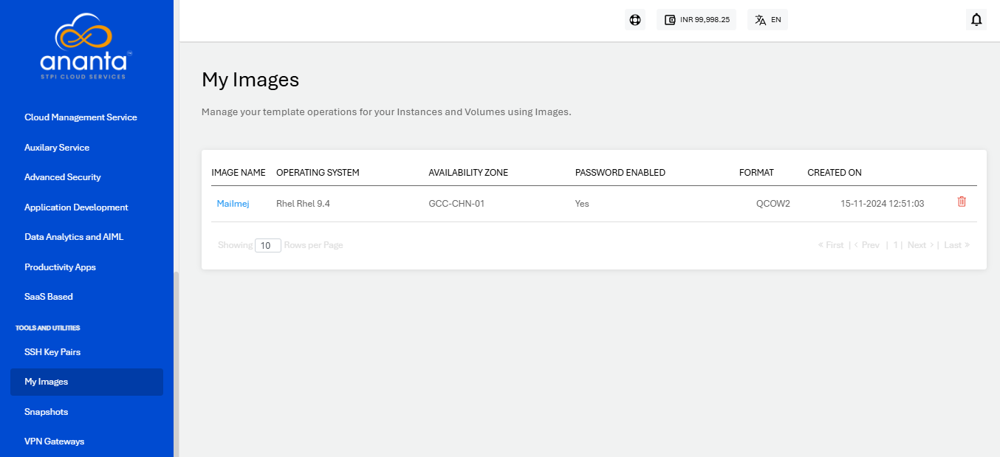
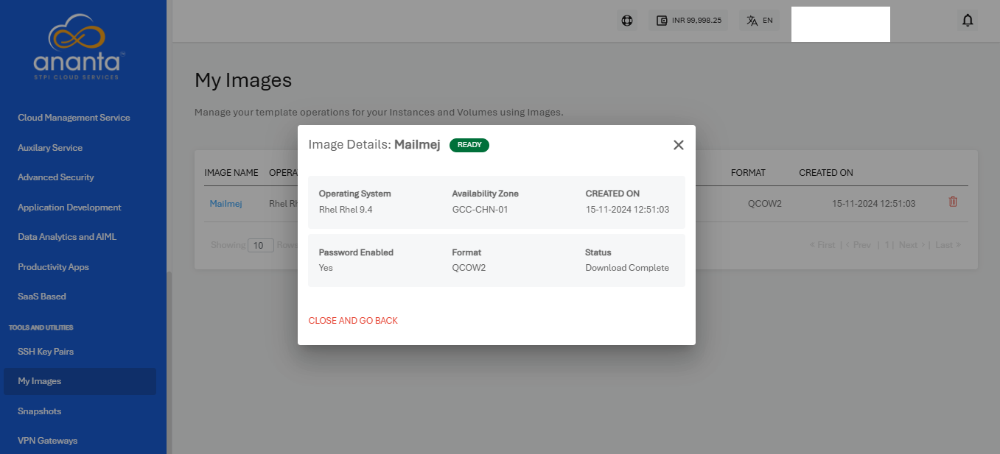

# Managing Custom Templates and Images
You can create custom OS templates from a Volume Snapshot.  To locate these custom templates, navigate to **Tools and Utilities > My Images** with the following details:

- Image Name
- Operating System
- Availability Zone
- Password Enabled
- Format
- Created On

You can delete the image by clicking on the delete icon present and the rightmost corner. You can also check the status by clicking on the image name.

These Images can be used while creating new Linux or Windows Instances and found under the **MY IMAGES** tab in the OS Collection section.

