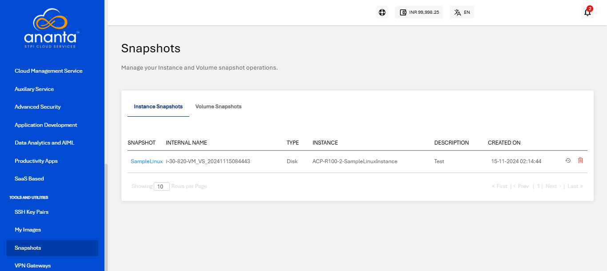
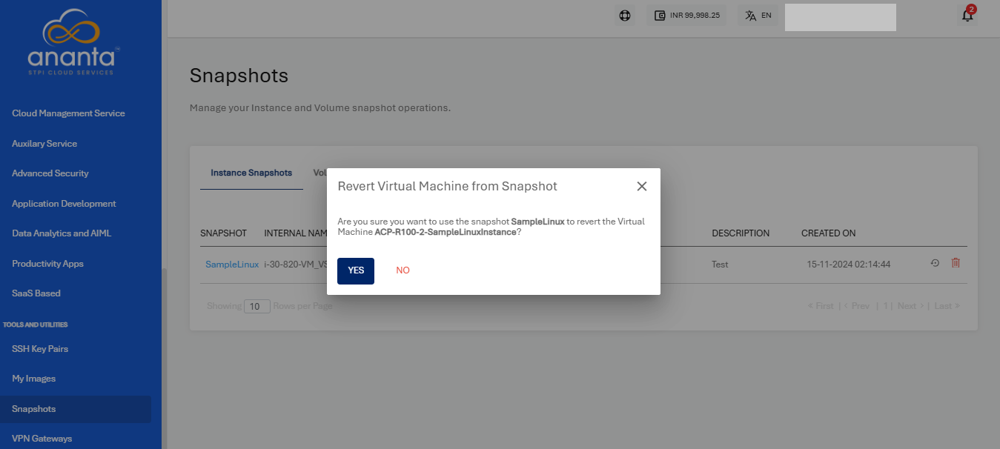
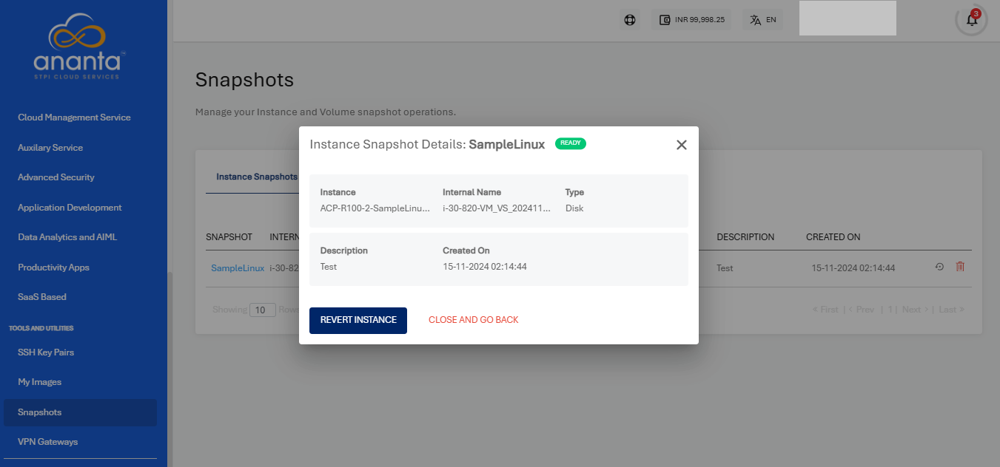
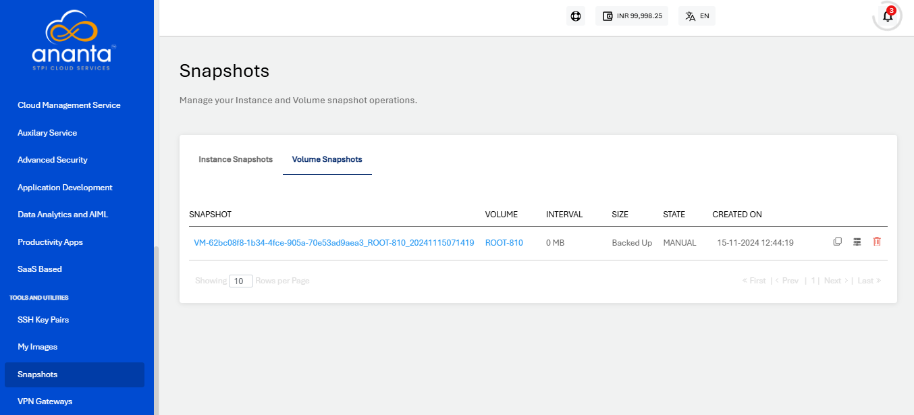
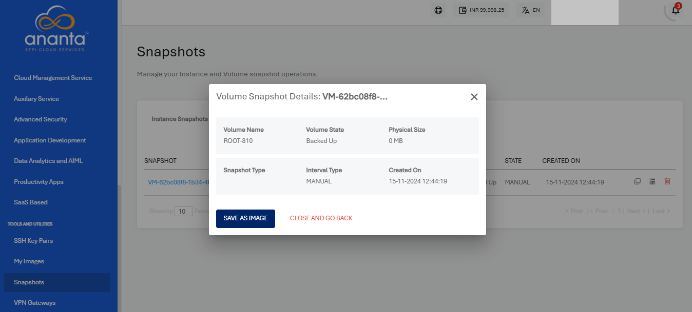
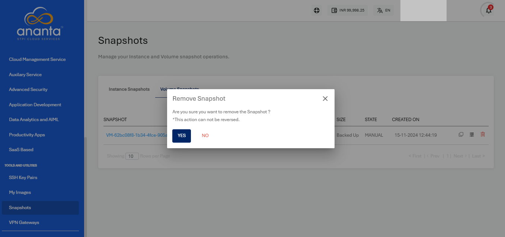

# Managing Instance and Volume Snapshots
Snapshots use the [Ananta Block Volumes](/docs/Storage/BlockVolumes/AboutBlockVolumes) Service and occupy billable storage space.

You can view and manage all your Instance and Volume Snapshots and perform various associated operations.
## Instance Snapshots

The Instance Snapshots tab will list the details as below:

- Snapshot Name
- Description
- Internal Name
- Instance Name
- Type
- Created On

You can revert the Instance to the snapshot point, which can be done by clicking on the icon present at the right corner before the delete icon, or also you can click on the snapshot name and then click on the **REVERT INSTANCE** button.

To view the details of the Instance Snapshot, click on the name of the **Snapshot** highlighted in **blue**.

You can simply delete the Instance Snapshot by clicking on the delete icon from the right corner.

## Volume Snapshots

The Volume Snapshots section shows the details as below:

- Snapshot Name
- Volume Name
- Size
- State
- Interval
- Created on

You can revert to the image from the volume snapshot, by clicking on the icon present at the right corner before the delete icon, or click on the snapshot name and then click on the **SAVE AS IMAGE** button.

To view the details of the Volume Snapshot, click on the name of the **Snapshot** highlighted in **blue**.

You can simply delete the Volume Snapshot by clicking on the delete icon from the right corner.

